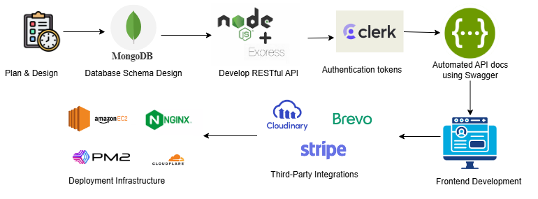
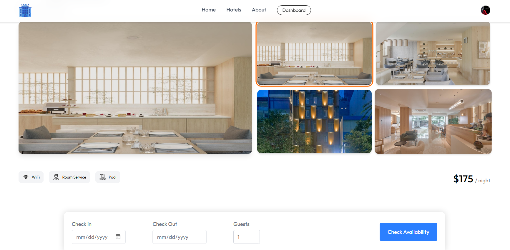
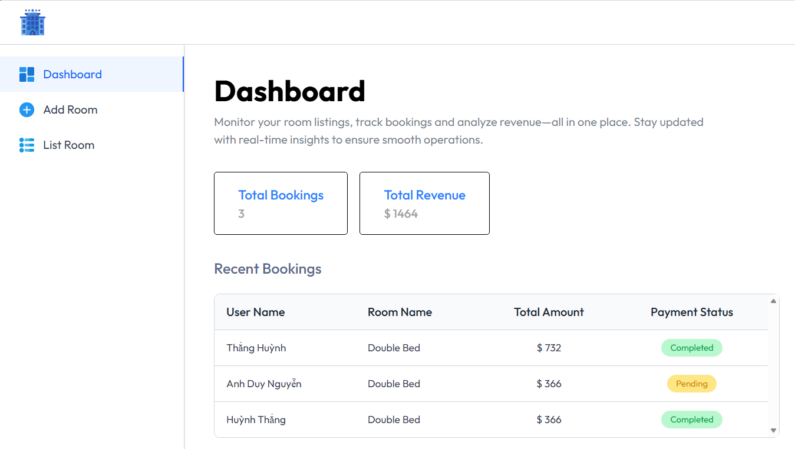

- [1. Project Overview](#1-project-overview)
- [2. Implementation](#2-implementation)
- [3. Key Features](#3-key-features)
  - [For Travelers :](#for-travelers-)
  - [For Hotel Owners:](#for-hotel-owners)
- [4. Implementation Process](#4-implementation-process)
  - [4.1. Plan \& Design](#41-plan--design)
  - [4.2. Database Design](#42-database-design)
  - [4.3. API Development \& Documentation](#43-api-development--documentation)
  - [4.4. Third-Party Integrations](#44-third-party-integrations)
  - [4.5. Deployment Infrastructure](#45-deployment-infrastructure)
- [5. Skills and Achievements](#5-skills-and-achievements)
  - [5.1. Technical Stack \& Tools](#51-technical-stack--tools)
  - [5.2. Skills Gained](#52-skills-gained)

# 1. Project Overview
**Context:**
The hospitality industry faces a disconnect between travelers struggling with fragmented booking systems and hotel owners lacking real-time management tools .

**Solution:**
**JMM Booking** bridges this gap by providing:
1.  **For Travelers:** A seamless, unified platform to search, view, and book hotels instantly .
2.  **For Hotel Owners:** A comprehensive dashboard to manage inventory, track revenue, and oversee bookings in real-time.
# 2. Implementation

 <b>Figure 1:</b> Flow Chart 

# 3. Key Features
## For Travelers :

- Search & Filter: Find hotels by destination, dates, and - guest count.

- Room Details: View high-resolution galleries and amenities.

- Secure Booking: Instant payment processing via Stripe.

- My Bookings: Manage booking history and upcoming trips.

 <b>Figure 2:</b> Travelers features 

## For Hotel Owners:
- Dashboard: Real-time analytics on Total Revenue and Bookings.

- Inventory Control: Add, edit, or remove rooms; toggle availability instantly.

- Booking Oversight: Track guest lists and payment statuses (Pending/Completed).
  

 <b>Figure 3:</b> Hotel Owners Features 

# 4. Implementation Process
## 4.1. Plan & Design
Defined user roles (Traveler/Owner) and mapped out core functionalities including Search, Booking Flow, and Property Management.

## 4.2. Database Design
Designed a **MongoDB** schema to handle flexible data relationships :

- Users: Authentication and profile data.

- Hotels & Rooms: Store details, amenities, prices, and owner references.

- Bookings: Link users to rooms with transaction status.

## 4.3. API Development & Documentation
Built **RESTful APIs** using **Express.js** with clear CRUD operations (GET, POST, PUT, DELETE) .

Integrated **Swagger** to auto-generate documentation, allowing the Frontend team to test endpoints directly without needing backend code access .

## 4.4. Third-Party Integrations
Leveraged specialized services to ensure security and scalability :

- **Clerk**: Secure authentication and session management.

- **Stripe**: Global payment gateway for PCI-compliant transactions.

- **Cloudinary**: Optimized image storage for hotel galleries.

- **Brevo**: Automated transactional emails for booking confirmations.

## 4.5. Deployment Infrastructure

- **AWS EC2**: Deployed the application on an Ubuntu 24.04 LTS instance.

- **Nginx** Configuration: Configured to serve the React build at root (/) and proxy /api requests to localhost:3000.

- Domain: Connected custom domain via **Namecheap** with **Cloudflare** nameservers .

# 5. Skills and Achievements
## 5.1. Technical Stack & Tools
* **Frontend**: React.js, Tailwind CSS for responsive and modern UI design 
* **Backend**: Node.js and Express.js for building robust RESTful APIs 
* **Database**: MongoDB for flexible and scalable data storage
* **Cloud & DevOps**: AWS EC2 (Ubuntu), Nginx (Reverse Proxy), PM2 (Process Manager), and Cloudflare (DNS & Security) 
* **Integrations**: 
  * **Stripe**: Secure payment processing .
  * **Clerk**: Authentication and session management 
  * **Cloudinary**: Media and image optimization
  * **Brevo**: Transactional email automation 
* **Documentation**: Swagger for API testing and documentation[cite: 46, 141].

## 5.2. Skills Gained
* **Full-Stack Proficiency**: Mastered the **MERN Stack** (MongoDB, Express, React, Node.js) to build a complete booking platform from scratch.
* **Cloud Infrastructure**: Gained hands-on experience deploying applications on **AWS EC2**, configuring **Nginx** as a reverse proxy, and managing production processes with **PM2** .
* **API Architecture**: Learned to design clean RESTful endpoints and document them professionally using **Swagger** to facilitate frontend-backend collaboration.
* **Security Implementation**: Implemented industry-standard security practices including **SSL/HTTPS** via Cloudflare, secure authentication flows with Clerk, and PCI-compliant payments with Stripe.
* **Real-world Problem Solving**: Solved complex logic for room availability tracking, inventory management, and automated booking workflows.